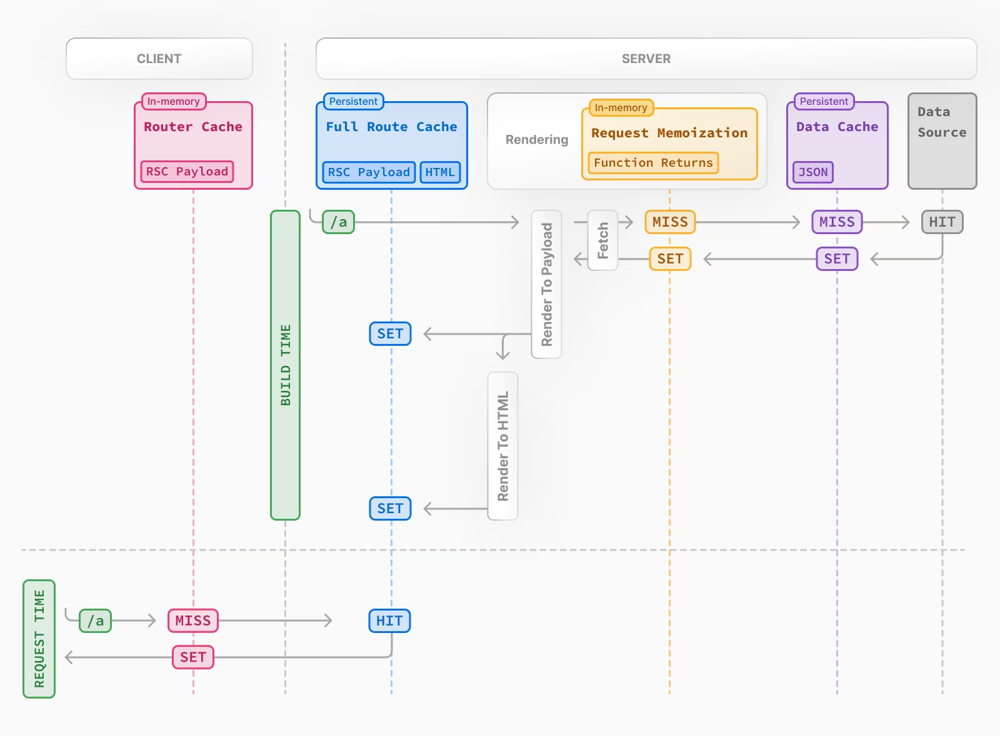
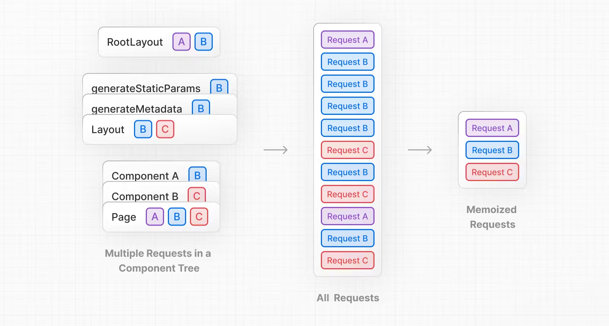
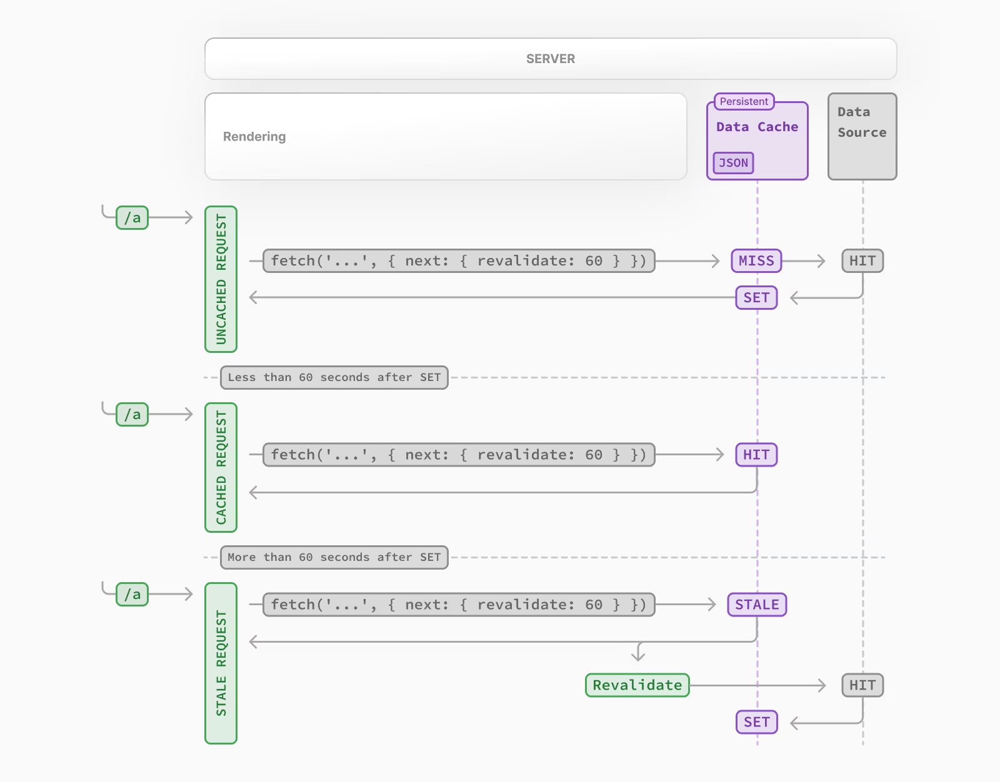

### Next.js에서 서버컴포넌트에서 병렬 패칭하기

- const getComments = async () => {
  await new Promise(resolve => setTimeout(resolve, 2000));
  return await (
  await fetch("https://jsonplaceholder.typicode.com/comments")
  ).json();
  };

- const getPost = async () => {
  await new Promise(resolve => setTimeout(resolve, 2000));
  return await (
  await fetch("https://jsonplaceholder.typicode.com/comments")
  ).json();
  };

- 2초를 지연시켜시키는 두개의 비동기 함수를 한 컴포넌트에서 사용시에 2초가 아닌 총 4초에 지연시간이 걸린다. 왜냐면 Next는 단일 스레드로(자바스크립트도 동일) 요청되기 때문에 하나씩 비동기 처리를 하게된다.

- 그럴때 사용되는것이 Promise.all 을 사용해서 병렬적으로 비동기함수들을 제어할 수 있다.

- const [
  { results: popular },
  { results: top_rated },
  { results: upcoming },
  { results: now_playing },
  ] = await Promise.all([
  getMovie(Movie_URL.Popular),
  getMovie(Movie_URL.Top_Rated),
  getMovie(Movie_URL.Upcoming),
  getMovie(Movie_URL.Now_Playing),
  ]);

- 이렇게 사용하여 비동기함수들을 동시에 실행시켜 가장 빠르게 완료되는 요청부터 응답받을 수 있다!

### Next에 Route handler , API handler

- Next에의 app경로에 api/route.ts를 만들어서 서버에서 HTTP메소드를 작성해서 페이지 요청이나 서버에대한 요청을 핸들링할 수 있다.
- GET에서 요청받는 req: Request 타입이나 NextRequest 를 import하여 searchPararms 를 가져올 수 있다.
- 서버에서 동작한 값을 return 할때는 Response 객체를 사용
- import { NextRequest } from "next/server";

- export async function GET(request: Request) {
  const { searchParams } = new URL(request.url);
  //
  /const searchParams = request.nextUrl.searchParams;
  const result = [{ id: 1, title: "text" }];
  return Response.json(result);
  }

- export async function POST(request: Request) {
  const data = await request.json();
  return Response.json(data);
  }

- export async function PUT(request: Request) {
  return Response.json("PUT METHOD!");
  }

- export async function PATCH(request: Request) {
  return Response.json("PATCH METHOD!");
  }

- export async function DELETE(request: Request) {
  return Response.json("DELETE METHOD!");
  }

### .env 파일 사용하기

- next 프로젝트 최상위 경로애 .env파일을 만들어서 TMDB_URL=https://api.themoviedb.org/3/movie
  와 같이 작성 후
- const url = `${process.env.TMDB_URL}/${type}?language=${lang}&page=${page}`;
  const options = {
  method: "GET",
  headers: {
  accept: "application/json",
  Authorization: "Bearer " + process.env.TMDB_TOKEN,
  },
  }; 와 같이 사용

### Use Effect내에서 클린 업

- 무한 스크롤을 구현중에 setTimeout을 사용하는 상황이 나왔다 궁금한 것이
- 그럼 해당 setTimeout은 클린업을 통해 초기화 해줘야할까?
  - 강사님의 답변은 setTimeout안에서 cllearTimeout을 하면 되지 않을까? 라는 답변!(이부분은 생각치도못했다..)
  - 왜냐면 cleanup은 unmount되었을 때 실행되니깐 무한스크롤상황에서의 loading 처리를 위한 부분에서 클린업은 굳이 필요없다?
  - const timeId = setTimeout(() => {
    setLoading(false);
    clearTimeout(timeId);
    }, 300);
  - return () => {
    clearTimeout(setTimeId);
    };

### Next 의 캐시

- https://nextjs.org/docs/app/building-your-application/caching#2-nextjs-caching-on-the-server-full-route-cache
- 
- https://fe-developers.kakaoent.com/2024/240418-optimizing-nextjs-cache/
- next route 캐시
  - 만약 페이지 이동시 (새로고침없이) 데이터가 캐싱된다.
  - 그래서 link태그를 통해 페이지의 데이터들을 왓다갔다 하며 확인해보면 변해야할 데이터가 변하지 않으며 캐싱되어있다.
  - 정적 라우트는 5분의 캐시가 유지
  - 정적페이지와 동적 페이지는 npm run build 된 결과로 확인가능한데
  - 빌드 된 결과물 경로 앞에 동그라미가 들어가있다면 정적이다
  - 동적 라우트는 30초의 캐시가 유지
  - 동적 라우트 [id]와 같이 []밑에 잇는 페이지나, headrs, cache 등등 next에서 지원하는함수를 사용하는컴포넌트는 동적 컴포넌트로 인식한다
  - 먼저 현재 url로 들어온 라우트로 캐시가 있는지 조회
  - 캐시된 데이터가 없다면 full route 캐시까지 확인
  - route 캐시와 full route 캐시는 상호보안적
  - route 캐시는 rsc payload 담당
  - route 캐시는 새로고침을 통해 초기화가 가능
    - Next는 두번의 렌더링을 하는데 첫번째 렌더링시 도움이 될만한 정보들을 저장하는 곳이다.
  - full route rsc payload와 html을 담당
    - full route 캐시는 npm run build 하기전까지 캐시를 확인할수가 없다.
    - 서버 저장소를 의미한다.
    - 페이지 새로고침으로는 저장소를 초기화할 수 없으며 다시 재배포나 재빌드를 통해 초기화 가능
  - 사용자에게 보여지는 페이지는 이미 route 캐시가 진행된 상태?
- 클라이언트에서 일어나는 라우터 캐시
- 서버단에서 실행되는 server 캐시

- HTTP 메소드의 GET 의 캐싱
  - https://developer.mozilla.org/ko/docs/Glossary/Cacheable
  - Next에서 이루어지는 캐싱과 HTTP 메소드에서 일어나는 GET 의 캐싱은 다른 문제?
  - Next에서으 Request momoization이 일어나면 브라우저 히스토리 명세서에도 1번만 기록이 남을까?

### Next에 Request memization

- 
- 하나의 렌더링과정에 결과값을 메모이제이션한다.
- 동일한 요청을 메모이제이션한다. 하나의 요청값만 서버에서 받는다
- route cache 에서의 상태에서 이미 hit를 통해 반환되었다면 이부분은 들어오지않는다.
- React 의 batching 시스템과 비슷해보인다
- 웹 서버로 페이지 요청이 들어오면 페이지에 필요한 데이터들을 fetch하게 되는데, 이때 동일한 endpoint로의 API fetch를 여러 컴포넌트에서 수행할 필요가 있다면 Request Memoization이 동작합니다. (React가 fetch 함수를 확장해놓았기 때문에 별도 설정은 필요 없습니다.)
- 상위 컴포넌트에서 API fetch 결과를 prop drilling 하는것 대신, 각 컴포넌트에서 fetch를 수행하도록 구현해도 실제 API 요청은 최초 1회만 전송되고 나머지는 응답값을 재사용합니다.
- 서버에서 호출되는 GET 메서드에만 적용되므로, POST나 DELETE API 또는 클라이언트에서 호출되는 API에는 적용되지 않습니다. 그리고 한 번의 서버 렌더링 동안만 유효하기 때문에 따로 revalidate 할 필요가 없을 뿐 아니라 할 수도 없습니다.

### Next에 Data caching

- data chching된 데이터는 개발자가 강제적으로 초기화하지않은 이상 data 캐시는 사라지지 않는다.
- 한 번 set이 된 이상 강제적으로 무력화 하지않는 이상
  사라지지않음
- 나머지 캐시 rquest, route, full-route 는 무력화 하지않아도 되는 경우가 잇다는 걸까?

- 적절한 캐시의 무력화 4가지 방법이 있다.

### Next에서 fetch 시스템

- Next 팀에서 fetch 사용법은 기존 fetch와는 다른 좀 더 확장된 매소드이다? (기능을 추가함)
- 그렇기 때문에 Next에서는 axios 와 같은 라이브러리를 안씀?
- 첫번째
- const posts = await (await fetch("http://localhost:4000/",{cache: 'no-cache'})).json();
- fetch 사용시 두번째 인자로 {cache : 'no-store' }로
  패칭에 요청에 대한 캐싱을 무효화 시킨다.
- <strong>캐싱에 대한 옵션이 적용된 fecth 요청이 우선시 된다!
  </strong>
- 두번째
- await fetch("http://localhost:4000/", { next: { revalidate: 10 } })
- {next : { revalidate: 캐싱 적용시간 }}
- revalidate 옵션을 통해 캐싱을 활용할 시간을 적용시킬 수 있다.
- 
- 지정된 시간이후에 데이터를 요청했다면 stale이라는 상태를 남긴후에 그 데이터를 <strong>아직까지는 사용한다!
  (Data cache 저장소를 이용)</strong>
- 이 이후에 새로운 데이터를 가져오기 위해 Data source 저장소까지 hit하게 된다!
- 세번째
- 서버액션을 사용
- 'use client' 를 이용해서(button 에 onClick handler를 사용하기 위해) form 태그에 action 옵션을 사용할 수 있다.
- "use server";
  // 특정 경로에 대한 캐시 무력화
  import { revalidatePath } from "next/cache";

export default function clickHandler() {
console.log("server aciton");
revalidatePath("/");
}

- 만약 똑같은 요청이 여러페이지에서 발생할때에 모든 요청에 대한 캐싱을 무력화 할때는 모든 url, 요청페이지를 revalidatePath("/");revalidatePath("/about"); 입력해줘야한다.

- revalidateTag('posts')
- await fetch("http://localhost:4000/posts", { next: { tags: ["posts"] } })
- revalidateTag 로 무력화를 시키기 위한 fetch 에 초기 설정 방법
- tages옵션을 통해 해당 요청 url에 대한 ['주소']를 입력하면 해당 요청에 대한 캐싱을 무력화 할 수 있다.
- 만약 여러 경로에 대한 요청 한번에 무력화 시키고 싶다면
- revalidateTag('posts'); revalidateTag('todos') 여러번 쓰면됨
- revalidateTag('/') 를 쓰면 모든 요청에 대한 무력화가 가능
