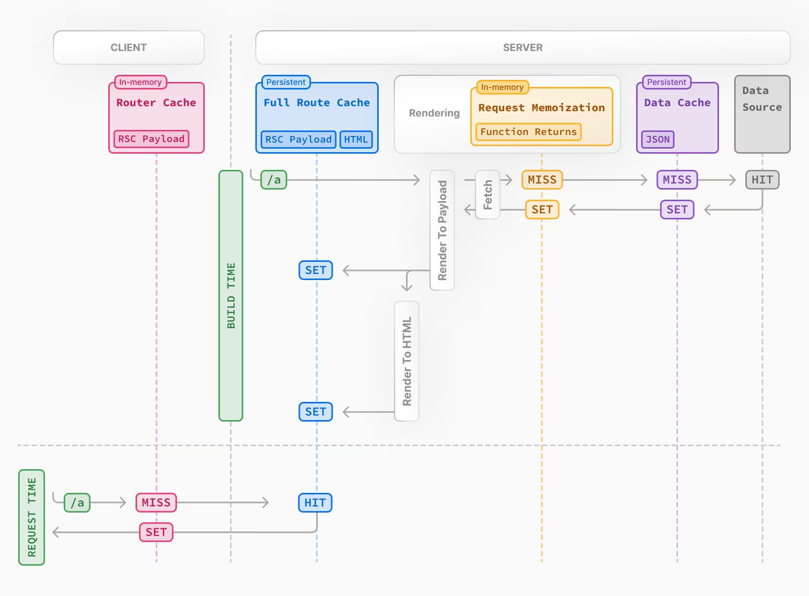
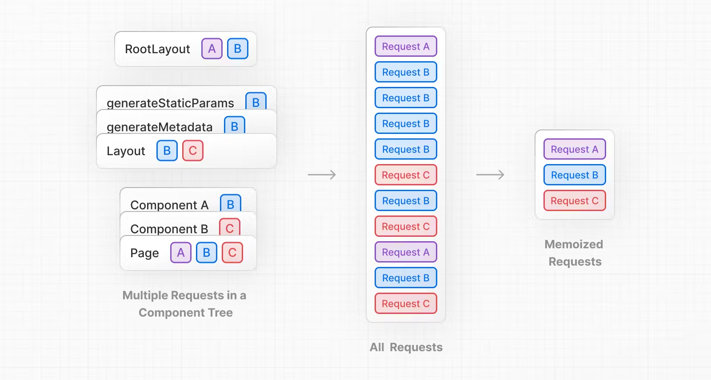
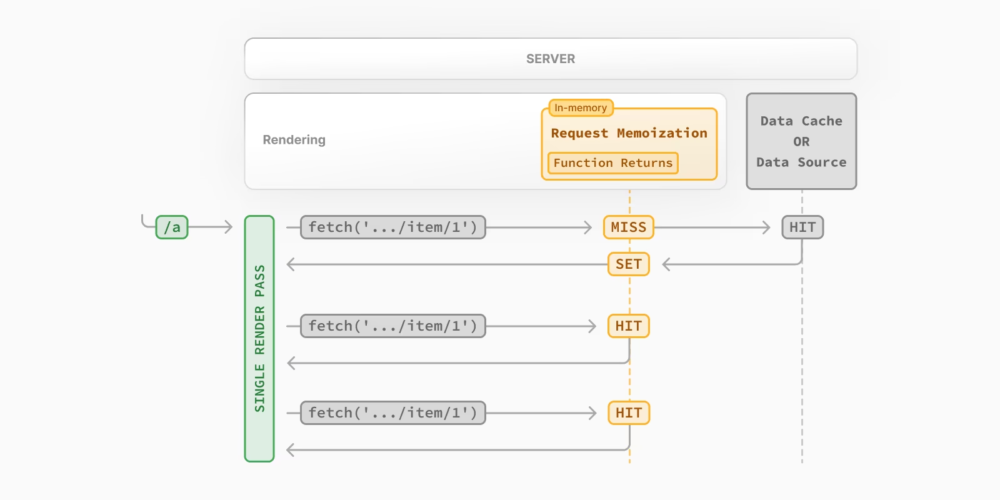
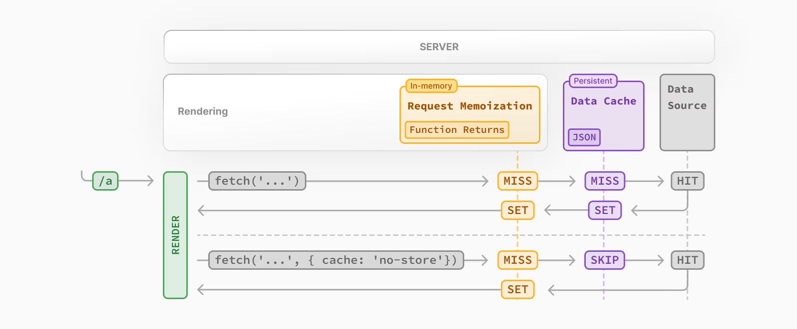
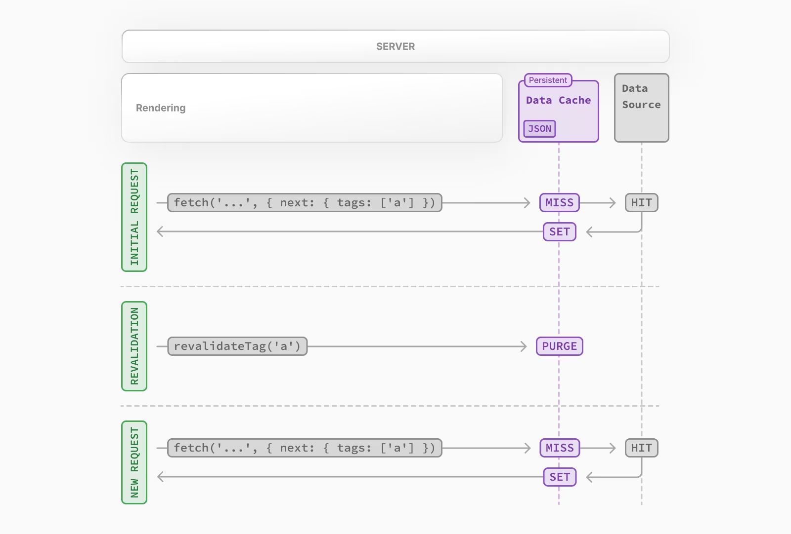

### Next 캐싱 상태 확인

- /\*_ @type {import('next').NextConfig} _/
  const nextConfig = {
  logging: {
  fetches: {
  fullUrl: true,
  },
  },
  };

export default nextConfig;

### Next의 route cache

- Next Cache동작은 route cache => full route cache => request memoization => data cache => data source 로 이어져 있다.
  
- 즉 초기 렌더링시 foull route cache를 통해 캐싱된 값을 찾고 세팅하고 없다면 더 안쪽까지 들어가게된다.
- 반대로 request route를 통해 이미 캐싱된 값이 있다면 안쪽에 캐싱 값들은 확인하지 않는다.(한 요청에 대한 값을 두페이지에서 사용하고있고 no-store를 사용하여 캐싱값을 사용하지 않으려고 시도하였을 때 (reqest memoization))
  해당 요청 코드가 있는 컴포넌트만 새롭게 계속 값을 가져오고
  요청 코드가 없이 props로 받는 컴포넌트는 route cache에 의해 이전값을 가져오게된다?.

### Next의 Request Memoization

- https://nextjs.org/docs/app/building-your-application/caching
  
- 컴포넌트가 렌더링 과정이 끝나면 완료되면 그때 초기화된다.
- 만약 request momoization의 저장소에 캐싱이 되지않았다면 data cache 저장소까지
- 리액트는 fetch API를 확장하여 동일한 URL과 옵션을 가진 요청을 자동으로 메모이즈(memoize)합니다. 이는 리액트 컴포넌트 트리 내에서 동일한 데이터를 여러 곳에서 요청하더라도 실제로는 한 번만 요청이 실행된다는 것을 의미합니다.

- 라우트 전체에서 동일한 데이터를 사용해야 하는 경우(예: 레이아웃, 페이지, 여러 컴포넌트에서), 트리의 최상단에서 데이터를 가져와 컴포넌트 간에 props로 전달할 필요가 없습니다. 대신, 데이터를 필요한 컴포넌트에서 직접 가져올 수 있습니다.

- 데이터를 상위 컴포넌트에서 가져와 하위 컴포넌트로 props로 전달할 필요가 없습니다.
  필요한 컴포넌트에서 직접 데이터를 가져올 수 있습니다, 이렇게 하면 컴포넌트 간의 결합도가 낮아지고, 코드의 가독성과 유지보수성이 향상됩니다.
  네트워크 요청을 여러 번 수행하는 것에 대한 성능 문제를 걱정할 필요가 없습니다.

---

##### 예시코드

- async function fetchData() {
  const response = await fetch('https://api.example.com/data');
  const data = await response.json();
  return data;
  }

function Layout() {
useEffect(() => {
fetchData().then(data => {
console.log('Layout data:', data);
});
}, []);

return 
Layout Component
;
}

function Page() {
useEffect(() => {
fetchData().then(data => {
console.log('Page data:', data);
});
}, []);

return 
Page Component
;
}

function MyComponent() {
return (

<Layout />
<Page />

);
}

export default MyComponent;

---

    - async function getItem() {
    // `fetch` 함수는 자동으로 메모이즈되며 결과가 캐시됩니다.
    const res = await fetch('https://.../item/1');
    return res.json();
    }

      // 이 함수는 두 번 호출되지만, 처음 한 번만 실행됩니다.
      const item = await getItem(); // 캐시 미스 (cache MISS)

      // 두 번째 호출은 라우트의 어디에서든지 이루어질 수 있습니다.
      const item = await getItem(); // 캐시 히트 (cache HIT)

- <strong> 요청 메모이제이션(request memoization)
  은 리액트 기능이며, Next.js 기능이 아닙니다. </strong>
- 메모이제이션은 fetch 요청에서 GET 메서드에만 적용됩니다.
- 메모이제이션은 리액트 컴포넌트 트리에만 적용되므로 다음과 같은 경우에 해당됩니다:

  - generateMetadata
  - generateStaticParams
  - 레이아웃(Layouts)
  - 페이지(Pages)
  - 기타 서버 컴포넌트(Server Components)

- <strong>
  하지만, 라우트 핸들러(Route Handlers) 내의 fetch 요청에는 적용되지 않습니다. 이는 라우트 핸들러가 리액트 컴포넌트 트리의 일부가 아니기 때문입니다.
  </strong>
- 하지만 일부분 route handler에서도 캐시가 된다?
- fetch가 적합하지 않은 경우(예: 일부 데이터베이스 클라이언트, CMS 클라이언트, GraphQL 클라이언트), 리액트 캐시 함수를 사용하여 함수를 메모이즈할 수 있습니다

#### Next의 Data Cache

- fetch메소드에서 no-stroe 옵션을 사용시 캐시를 저장하지않으며, data cache저장소에 데이터를 set하긴 하지만, 결론적으로는 data source 저장소를 이용한 뒤
  우회(skip)한다?
  

        async function fetchData() {
        const res = await fetch('https://api.example.com/data', { cache: 'no-store' });
        return res.json();
        }

        // 첫 번째 호출 시 캐시 미스 발생
        const data = await fetchData(); // 캐시 미스 (cache MISS)

        // 동일한 렌더 패스 내에서 두 번째 호출 시 캐시 히트 발생
        const data = await fetchData(); // 캐시 히트 (cache HIT)

- 캐시된 응답이 발견되면: 즉시 반환되고 메모이제이션(memoization)됩니다.
- 캐시된 응답이 없으면: 데이터 소스로 요청이 전송되고, 결과는 데이터 캐시에 저장되며 메모이제이션됩니다.
- 캐시되지 않은 데이터 (예: { cache: 'no-store' }): 결과는 항상 데이터 소스에서 가져오며 메모이제이션됩니다.

### Data cache 와 Request memoizaiton 의 차이

- 두 가지 캐싱 메커니즘 모두 캐시된 데이터를 재사용하여 성능을 향상시키지만, 차이점이 있다.

- #### 지속성 (Persistence):

  - 데이터 캐시 (Data Cache): 데이터 캐시는 들어오는 요청과 배포 간에 지속됩니다. 이는 서버가 재시작되거나 새로운 배포가 이루어지더라도 캐시된 데이터가 유지된다는 것을 의미합니다.
  - 요청 메모이제이션 (Request Memoization): 요청 메모이제이션은 요청의 수명 동안에만 지속됩니다. 즉, 동일한 렌더 패스 내에서만 유효하며, 요청이 완료되면 메모이제이션된 데이터는 제거됩니다.

- #### 중복 요청 감소:

  - 메모이제이션: 메모이제이션을 통해 동일한 렌더 패스에서 네트워크 경계를 넘어 데이터 캐시 서버(CDN 또는 엣지 네트워크)나 데이터 소스(데이터베이스 또는 CMS)로 가는 중복된 요청 수를 줄입니다.

  - 데이터 캐시: 데이터 캐시는 원본 데이터 소스에 대한 요청 수를 줄입니다. 이를 통해 전체 서버 부하를 줄이고, 데이터 소스의 응답 시간을 개선할 수 있습니다.

- On-demand Revalidation
  
  revailddateTag 를 사용하면 요청 즉시 해당 캐싱을 삭제 후
  data source에 hit 한후 data cache에서 set한다.

### Next FormData,FormAction

    - export default async function FormAdd() {
        const serverAction = async (formdata: FormData) => {
        "use server";
        console.log(formdata.get("name"));
        console.log(Object.fromEntries(formdata));
        const result = await fetch("http://localhost:4000/users", {
        method: "POST",
        headers: {
        "Content-Type": "application/json",
        },
        body: JSON.stringify(Object.fromEntries(formdata)),
        });
        if (result.ok) {
        revalidatePath("/");
        // 어떠한 동작을 통해 서버의 상채가 변화할때
        // revalidatePath("/"); 이후에
        // redirect() 까지 적용하여 사용하면 좋다
        redirect("/");
        }
    };

- ### 해당 코드를 libs/action.ts 폴더를 만들어서 사용

  - "use server";
    import { revalidatePath } from "next/cache";
    import { redirect } from "next/navigation";

  export const serverAction = async (formdata: FormData) => {
  "use server";
  console.log(formdata.get("name"));
  console.log(Object.fromEntries(formdata));
  const result = await fetch("http://localhost:4000/users", {
  method: "POST",
  headers: {
  "Content-Type": "application/json",
  },
  body: JSON.stringify(Object.fromEntries(formdata)),
  });
  if (result.ok) {
  revalidatePath("/");
  // 어떠한 동작을 통해 서버의 상채가 변화할때
  // revalidatePath("/"); 이후에
  // redirect() 까지 적용하여 사용하면 좋다
  redirect("/");
  }
  };

### MongoDB 연결하기

- 비쥬얼 스튜디오 코드에서 mongoDB 확장 프로그램 설치
- mongDB사이트에서 제공하는 url 및 내 정보 가져오기
- 익스텐션에서 해당 url 입력

- ### Schema 생성

  import mongoose from "mongoose";
  const userSchema = new mongoose.Schema(
  {
  name: {
  type: String,
  required: true, // 필수 필드
  },
  email: {
  type: String,
  required: true, // 필수 필드
  unique: true, // 고유 필드
  },
  },
  { timestamps: true }
  ); // timestamps 옵션을 통해 생성 및 업데이트 시간을 자동으로 기록

  // 사용자 모델 생성
  const User = mongoose.models.User || mongoose.model("User", userSchema);

  export default User;

- ### connect DB 함수

  - import moongoose from "mongoose";
    const connectDB = async () => {
    try {
    console.log(moongoose.connection.readyState);
    if (moongoose.connection.readyState) return;
    const coon = await moongoose.connect(process.env.MONGODB_URL as string);
    console.log(`mongoDB connected ${coon.connection.host}`);
    } catch (e) {
    console.log("error connected", e);
    process.exit();
    }
    };

    export default connectDB;

- #### MongoDB 에서 제공하는 스키마 함수 사용

        - export async function fetchMongoDB() {
        connectDB();
        const user = await User.find({});
        console.log(user as any);
        return user;
        }

        - export async function InsertMongoDB(formdata: FormData) {
        connectDB();
        const name = formdata.get("name");
        const email = formdata.get("email");
        const newUser = new User({ name, email });

        newUser.save();
        console.log(newUser);
        revalidatePath("/");
        redirect("/");
        }

         - export async function deleteMongoDB(formdata: FormData) {
        connectDB();
        const userId = formdata.get("id");
        await User.findByIdAndDelete(userId);
        revalidatePath("/");
        }
