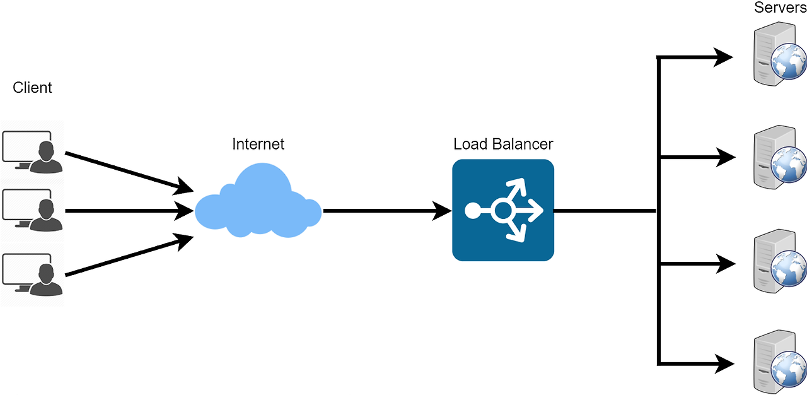
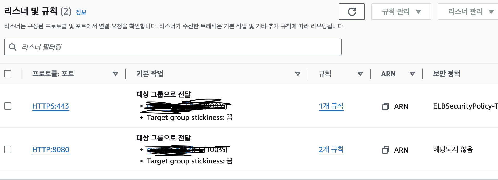

### 로드 밸런서(Load Balancer)

    Load Balancing 이란 부하 분산이란 뜻으로 컴퓨터 네트워크 기술의 일종으로
    두 개 이상의 중앙처리장치 혹은 저장장치어ㅏ 같은 컴퓨터 자원들에게
    작업을 나누는 것을 의미.
    트랙픽이 과도하게 몰려 서비스가 중단되는 현상을 막기 위한 기술이다.

    트래픽을 하나의 경로로 받아서여러 개의 인스턴스에 분산하게 되어,
    유저 입장에서는 각각의 인스턴스에 일일이 접근해서 관리하는 게 아닌
    하나의 주소로 접속해서 관리할 수 있게 된다. 인
    스턴스가 떨어져 나가거나 오류가 나서 트래픽을 수신하지 못할 때에도
    로드밸런서가 스마트하게(health check / monitoring) 알아서
    트래픽을 전송하지 않게 하고, 새로운 인스턴스가 등록이 되면 자동으로 분산을 시켜준다.

---

### 리스너(Listener)

    리스너는 프로토콜과 포트를 기반으로 요청을 받아 검사하고
    이를 적절한 타겟으로 전달하는 기능을 수행한다.

    리스너는 외부의 요청을 받아들이기 때문에
    모든 로드 밸런서는 최소 1개 이상의 리스너를 필요로 하며,
    최대 10개까지 설정할 수 있다.
    뿐만 아니라 SSL 인증서를 게시하여 SSL Offload를 실시할 수도 있다.

---

### 규칙(Rule)

    리스너 룰(rule)은 리스너와 타겟 그룹 사이의
    트래픽 분배를 위한 라우팅 규칙에 해당한다.
    룰은 우선순위, 액션, 조건 등의 정보를 담고 있으며,
    path, host, HTTP header, source IP, query parameter 등의 다양한
    조건이 만족되었을 때, 지정된 액션을 수행하는 방식으로 작동한다.

---

### 대상 그룹 (Target Group)

    대상그룹은 리스너가 전달한 요청을 처리하기 위한 부하분산 대상들의 모임이다. 
    분산을 할 때 어디로 분산할 것이냐를 모은 그룹들이 대상그룹이다.EC2가 전달받은 요청을 처리할 수 있는지를 체크하는 헬스 체크(Health Check) 기능과,
    이 대상 그룹에 요청 처리가 가능한 EC2가 몇 개인지
    확인하는 요청 처리에 관련된 모니터링(Monitoring) 기능이 들어있다.

---

### 상태 검사(Health Check)

    ELB에 연결된 인스턴스에 직접 트래픽을 발생시켜
    인스턴스가 살아있는지 체크하는 기능이다.
    타깃 그룹에 대한 헬스 체크를 통해 현재
    정상적으로 작동하는 인스턴스로만 트래픽을 분배한다.

    인스턴스의 상태를 자동으로 감지해서 오류가 있는 시스템은 배제하고,
    만일 인스턴스가 회복되면 LB가 자동으로 감지하여 인스턴스에 트래픽을 보내준다.

    이를 통해 장애가 전파되는 것을 방지하여 고가용성을 확보할 수 있으며,
    상태 확인 개선을 통해 상세한 오류 코드를 구성할 수 있다.
    새로운 지표로 EC2 인스턴스에서 실행되는 각 서비스의 트래픽을 파악할 수 있다.

    상태는 두 가지로 나뉨

    - InService(서비스 살음)
    - OutofService(서비스 죽음)

    이 부분에서 초기생성 시 서비스가 죽어있는 오류가 발생했었는데
    상태 체크를 위해 http://domain.com:8080/ 으로
    HTTP 요청을 보내어 응답값을 통해 상태를 검사한다고 함!
    밑에 코드를 추가하여 해결하였다.

    - /health 엔드포인트 추가 - 상태 코드 200을 반환하여 서버가 정상적으로 작동하는지 확인

        </>app.get("/health", (req, res) => {
        res.status(200).json({ status: "Healthy" });
        });

### SSL Termination지원

    인스턴스에서 SSL 설정이 불필요

    SSL Termination을 사용하면, SSL 인증서와 암호화 처리를
    로드 밸런서에서만 관리하면 됩니다.

    백엔드 서버(인스턴스)에는 SSL 인증서를 설치할 필요가 없고,
    SSL 통신에 따른 추가 부하도 발생하지 않습니다.

        (1) 인스턴스 부하 감소

        SSL 암호화와 복호화 작업은 많은 컴퓨팅 리소스를 필요로 합니다.
        만약 모든 백엔드 서버가 각각 SSL 암호화를 처리하게 된다면,
        서버에 부하가 많이 발생하게 됩니다

        (2) SSL 인증서 관리 간소화

        서버가 여러 대일 경우,

        SSL 인증서를 설정하고 주기적으로 갱신하는 것은 매우 번거로울 수 있습니다.

        그러나 SSL Termination을 사용하면,

        인증서를 로드 밸런서에서만 관리하므로,
        모든 서버에 인증서를 설치할 필요가 없습니다.

        인증서 갱신이나 교체가 필요할 때도 로드 밸런서에서만 한 번 처리하면 됩니다.
